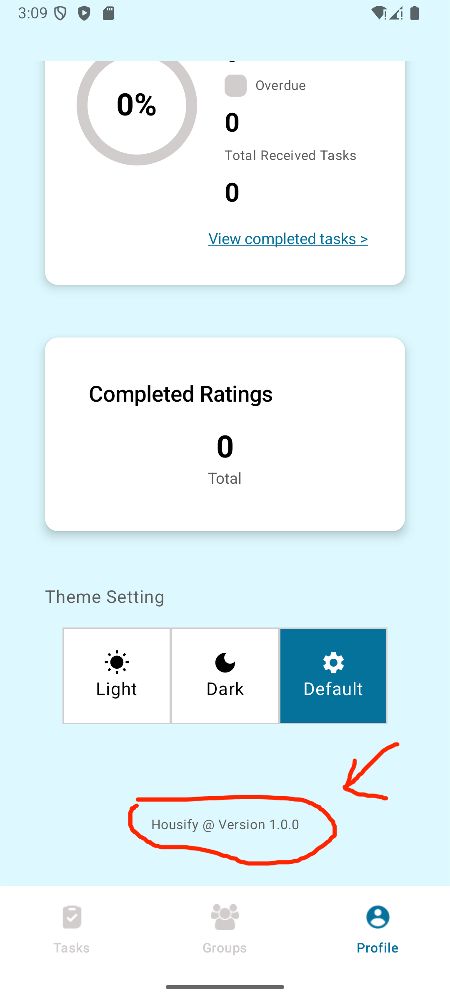
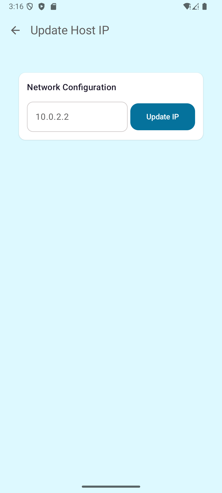

# Housify — Household Cleaning Task Manager (Android / Kotlin)

Housify is a **mobile application for shared living environments** (students, young professionals, tenants, roommates) that **centralizes household cleaning tasks** and helps groups keep a home clean through **clear ownership, fair distribution, and lightweight coordination**.

In many shared houses/apartments, chores can become inconsistent or unfairly distributed, which often leads to misunderstandings or neglected tasks. **Housify’s purpose is to streamline task management and improve accountability** so everyone knows what needs to be done, by whom, and when.

## What this project demonstrates
- End-to-end Android development in **Kotlin**
- Modern UI with **Jetpack Compose** and **Navigation Compose**
- Clean architecture-style structure (`data/`, `domain/`, `feature/`, `ui/`, `di/`)
- **Dependency Injection** with **Hilt**
- **Local persistence** with **Room**
- **Networking** with **Retrofit + OkHttp**, JSON parsing with **Moshi/Gson**
- **Authentication** using **Firebase Auth**
- **Push notifications** with **Firebase Cloud Messaging**
- **Deep links** to support “join group” invitations (URI scheme)
- Camera/QR-related capability using **CameraX** and **ZXing**

## Key App Flows (High-level)
- **Auth**: Login / signup (Firebase Auth)
- **Tasks**: View and complete tasks assigned to you
- **Groups**: Manage or join shared household groups
- **Profile**: Personal settings (including app configuration for backend host IP in local dev)

## Tech Stack
**Language:** Kotlin (100%)  
**UI:** Jetpack Compose, Material 3, Navigation Compose  
**DI:** Hilt (`@HiltAndroidApp` in `HousifyApplication`)  
**Data & Storage:** Room, DataStore (preferences)  
**Networking:** Retrofit, OkHttp logging interceptor, Moshi/Gson converters  
**Media / Device:** CameraX, ZXing  
**Firebase:** Auth, Cloud Messaging  
**Testing:** JUnit, coroutines test, MockK, MockWebServer, Truth

## App Navigation (screens)
Navigation routes are defined in `NavRoutes.kt` and include:
- `Auth` (login/signup)
- Bottom navigation screens: `Tasks`, `Groups`, `Profile`
- Group/task sub-screens: `GroupEntry`, `CreateTask`, `TaskDetails`, leaderboard screens
- Completion flows: `TaskToDo`, `RatingToDo`, `CompletedTasks`, `CompletedRatings`
- Invite flow: `JoinGroup(invitationCode)`
- Local dev config: `UpdateHostIp`

## Deep Linking (Join Group)
The app supports deep links for group invites using a custom URI scheme:

- **URI format:** `housify://join-group/{invitationCode}`

You can test this via ADB:

```bash
adb shell am start -a android.intent.action.VIEW -d "housify://join-group/YOUR_CODE"
```

> Note: ensure the closing quote is included in your command.

## Prerequisites
- **Android Studio** (recommended latest stable)
- Android SDK installed via Android Studio

## How to Run

### 1) Run on an Android Emulator
1. Open the project in Android Studio (this repository root).
2. Wait for Gradle sync.
3. Choose an emulator device.
4. Press **Run** (▶) or `Shift + F10`.

### 2) Run on a Physical Android Device (connect to a local backend)
If your backend is running on your machine and your phone is on the same network, you may need to configure the backend host IP.

1. **Find your computer’s local IP**
   - Windows: `ipconfig` → look for **IPv4 Address**
   - macOS/Linux: `ifconfig | grep "inet "`

2. **Update Host IP inside the app**
   - Go to **Profile**
   - Scroll to the bottom
   - Tap **“Housify @ Version 1.0.0”** three times to open **Update Host IP**
   - Update the host IP with your machine’s local IP

   
   

3. **Allow cleartext traffic for your local IP (if needed)**
   - Open: `app/src/main/res/xml/network_security_config.xml`
   - Add your local IP under the `<domain-config>` section (along with `10.0.2.2` for emulators), for example:

   ```xml
   <network-security-config xmlns:android="http://schemas.android.com/apk/res/android">
      <domain-config cleartextTrafficPermitted="true">
         <domain includeSubdomains="true">10.0.2.2</domain>
         <domain includeSubdomains="true">192.168.1.10</domain>
      </domain-config>
   </network-security-config>
   ```

4. Save and run the app.

## Permissions Used (Why they are needed)
- `INTERNET` / `ACCESS_NETWORK_STATE`: API calls + connectivity checks
- `POST_NOTIFICATIONS`: push notifications (Android 13+)
- `CAMERA` (optional): QR scanning / camera-based features

## Project Structure (at a glance)
- `app/src/main/java/com/example/housify/`
  - `data/` — remote + local data sources (API/DB), DTOs, repositories
  - `domain/` — business logic / use-cases (if present)
  - `feature/` — feature-based UI + view models (Auth, Tasks, Groups, Profile, etc.)
  - `ui/` — shared UI components + theme
  - `di/` — Hilt modules
  - `util/` — utilities (e.g., network observer)
- `images/` — README screenshots

---
